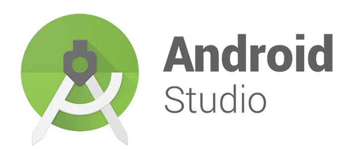
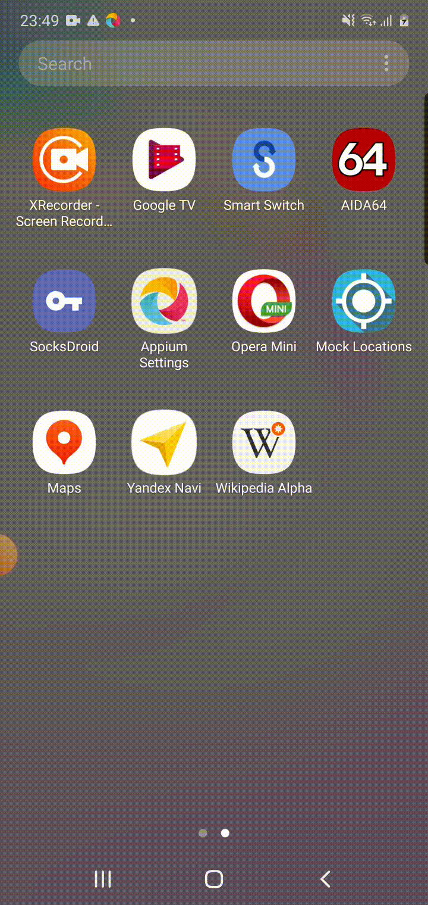
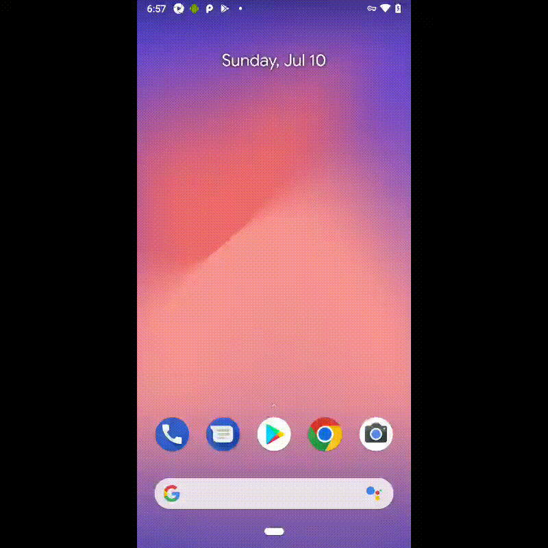
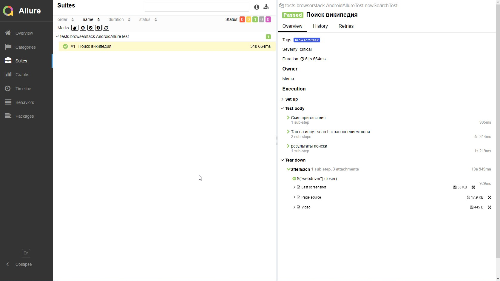
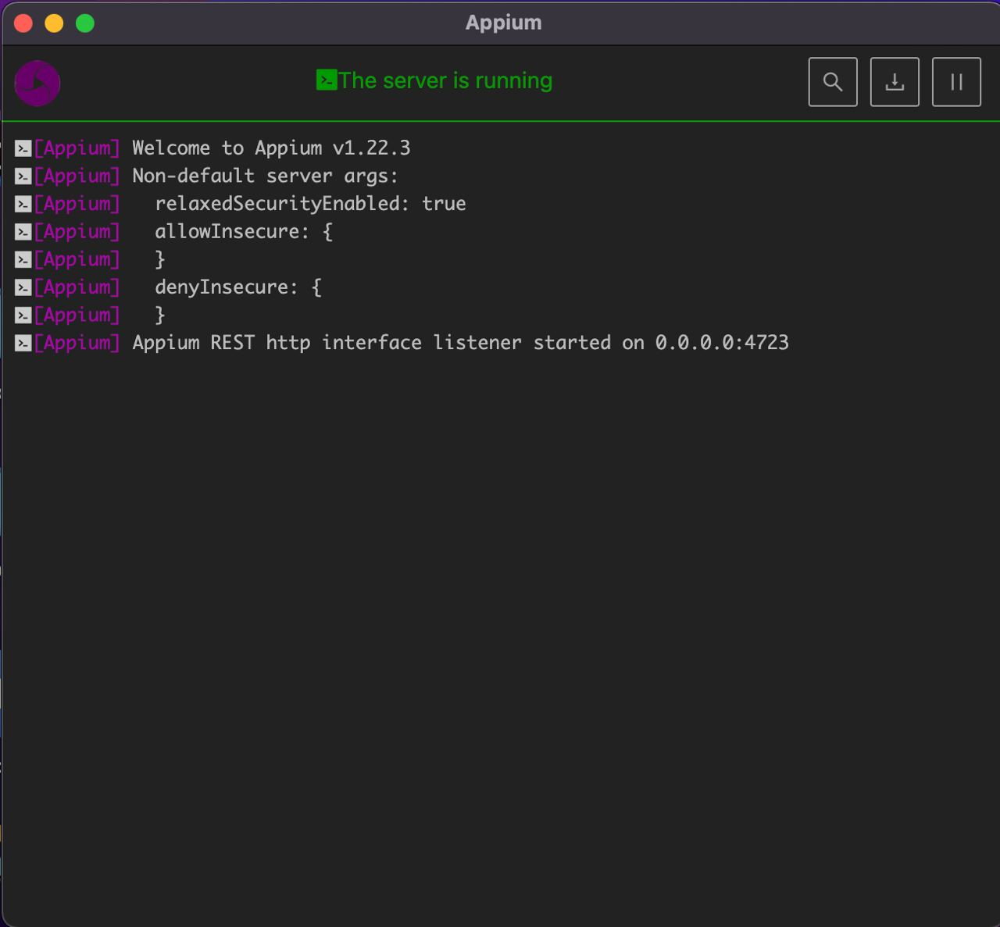

# Автоматизация мобильных приложений (Appium с использованием эмуляторов и физических девайсов + Browserstack)

## Technology Stack
|<a href="https://www.jetbrains.com/idea/"></a>  | <a href="https://developer.android.com/studio"></a> |  |  |  |  |  |  |  |  |
|:------------------------------------------------------------------------------------------------------------------:|:------------------------------------------------------------------------------------------------------------------------------:| :---------: |:---------------------------------------------------------------------------------------------------------------------:|:------------------------------------------------------------------------:|:-------------------------------------------------------------------------:|:-------------------------------------------------------------------:|:------------------------------------------------------------------------------------:|:--------------------------------------------------------------------------:|:---------------------------------------------------------------------------:|
|                                                        IDEA                                                        |                                                         Android Studio                                                         | Java |                                                          Git                                                          |                                  JUnite                                  |                               Browserstack                                |                               Appium                                |                                     Rest-Assured                                     |                                   Allure                                   |                                   Jenkins                                   |

## Коротко о проекте
* Gradle - для сборки проекта;
* В основе автотестов Selenide-appium;
* Удаленный запуск осуществляется в Browserstack;
* Allure - для визуализации результатов тестирования ;
* Локальный запуск осуществляется либо на эмуляторе, либо на реальном девайсе;
* Для гибкой настройки конфигов используется библиотека Owner;
* Отдельные тэги в билде для запуска локально или удаленно;
* CI/CD - Jenkins.

## Запуск теста на реальном девайсе (английская локаль):


## Запуск теста через сервис Browserstack (Английская локаль):


## Пример Allure отчета:


## Краткая документация по запуску теста:
## Через сервис Browserstack
* Создайте properties file (в нем прописывается конфигурация запуска):
> ```src/test/resources/config/browserstack.properties```

* Пропишите следующие данные:
>```
>deviceName=Google Pixel 3 -- название выбранного девайса в сервисе
>platformVersion=9.0 --
>user=bsuse*****     -- credentials(имя пользователя) вашего аккаунта в Browserstack
>key=3Sjd**********  -- credentials(ключ) вашего аккаунта в  Browserstack 
>app=bs://b0532bd2d289a275a8eb997acdabc0f8f2d491e2 -- ссылка на приложение, которое будет тестироваться 
>url=http://hub.browserstack.com/wd/hub -- адрес запуска
>```
* Запуск тестов осуществляется следующей командой:
> ```./gradlew clean browserstack -Ddevice=browserstack```
## Запуск тестов на эмуляторе девайса (установлена Android Studio)
* Запуск Android studio:
> a: (More Actions) -> SDK Manager -> Install\check need SDK Platform (for example: Android 11.0)
> 
>b: (More Actions) -> Virtual Device Manager -> Create need device (for example: Pixel_4_API_30) -> Run


* Создайте  properties file и пропишите в нем следующую информацию (по аналогии с запуском в Browserstack):
> ```src/test/resources/config/emulator.properties```
* Пропишите следующие данные :
>```
>deviceName=******** - @DefaultValue("Pixel_4_API_30") -- название вашего эмулятора
>platformName=Android
>platformVersion=**** -  @DefaultValue("11.0") -- версия ос вашего эмулятора
>app=https://github.com/wikimedia/apps-android-wikipedia/releases/download/latest/app-alpha-universal-release.apk?raw=true
>url=http://localhost:4723/wd/hub
>```
* Запустите Appium Server on 4723 port 
  
* Запуск тестов осуществляется следующей командой:
> ```./gradlew clean selenide -Ddevice=emulator```

## Запуск тестов на реальном (физическом) девайсе
* Соедините ваш смартфон с PC через ADB (предварительно включите режим разработчика на девайсе) 
* Проверьте ваш "серийник" с помощью команды в терминале:
>Используйте "adb devices" комманду from %ANDROID_HOME%\platform-tools, пример выполненной команды:
```
...\AppData\Local\Android\Sdk\platform-tools>adb devices
List of devices attached
7hdqkhayaiz9he3g        device
```

* Создайте properties file и пропишите в нем следующую информацию (по аналогии с запуском в Browserstack):
> ```src/test/resources/config/real.properties```
>
* Пропишите следующие данные:
>```
>deviceName=******** -- серийник из adb
>platformName=Android
>platformVersion=**** -- версия ос вашего девайса
>app=https://github.com/wikimedia/apps-android-wikipedia/releases/download/latest/app-alpha-universal-release.apk?raw=true
>url=http://localhost:4723/wd/hub
>```
* Запустите Appium Server on 4723 port (по умолчанию)
* Запуск тестов осуществляется следующей командой:
> ```./gradlew clean selenide -Ddevice=real```

## Примечание
* В папке config уже лежат примеры конфигов для всех типов запуска
* в папке apk лежит сборка приложения, на которой проводилось тестирование


